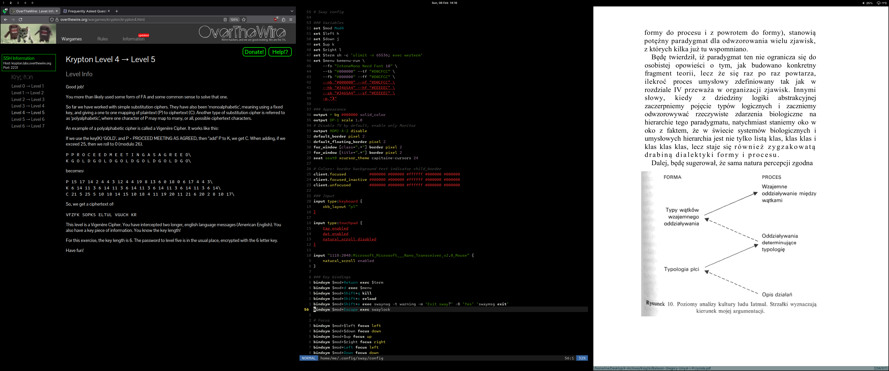

# Dotfiles

[](LICENSE)
[](https://github.com/mggpie/dotfiles/actions/workflows/lint.yml)



Ansible-managed Void Linux (glibc) desktop with Sway, built for long sessions. One `bootstrap.sh` takes a fresh Void install to a fully configured workstation - window manager, audio stack, Bluetooth, shell, editors, and 50+ applications - in a single idempotent run.

I picked Void Linux because to me it's one of the most architecturally interesting distros out there, right next to NixOS - runit instead of systemd, xbps that's faster than anything else, and rolling release with actual QA. It ships totally bare, so you build everything from scratch exactly how you want it.

The aesthetic is purely functional. Tango Dark and Adwaita Dark palettes with Intel One Mono Nerd Font were chosen for readability during 12-hour days, not for screenshots. Everything is keyboard-driven, minimal, and stays out of the way.

## What's Inside

**OS & Desktop:** Void Linux glibc (runit init) with Sway on Wayland. Waybar, bemenu, mako, swaylock, kanshi for multi-monitor hot-plugging (3440x1440 ultrawide + 4K TV via HDMI).

**Audio:** PipeWire + WirePlumber with per-device codec negotiation (Bluetooth A2DP/AAC for Bose QC45, HDMI stereo profiles for monitor and TV). Lofi radio with 8 YouTube stations via mpv (audio only) - random station on boot, prev/next buttons and station name in Waybar, click station to toggle. The `bose` function is a 146-line Bluetooth state machine that detects which display is active, picks the correct audio fallback, tries three connection strategies, waits for PipeWire to register the sink, and forces A2DP. The `tv` function hot-switches all workspaces and audio between monitor and TV.

**Shell:** Fish with ~30 custom functions. `deploy sway fish mpv` auto-commits, pushes, and runs `ansible-playbook` with those tags in one shot. `startup` scripts a workspace layout (Firefox 33% left + VSCode 66% right) with a scratchpad notepad accessible via Super+\`. `weather` fetches forecasts from Open-Meteo and maps WMO codes to Nerd Font icons via jq for Waybar.

**RGB as status indicator:** The PC's ASUS Aura LEDs aren't cosmetic - they're a state machine. Rainbow = system ready. Flashing red = maintenance running. Off = shutdown timer active. Rainbow flash = 2-second warning before poweroff.

**Packages & system:** Dual package manager - xbps (~1200 packages), Nix as unprivileged overlay (~500) for apps not in Void repos. Tuned i915 kernel params, TTY autologin, only TTY1-2 kept, unused services masked, CPU mitigations off (never do this on a production machine), `GRUB_TIMEOUT=0`. Ansible Vault for SSH keys and tokens, `no_log: true` on secret tasks.

**File management:** `lf` with sixel image previews, video thumbnails, PDF rendering, FZF integration, and drag-and-drop. PARA method at filesystem level with cron auto-migration from Downloads to Inbox. `poweroff` unmounts all USB drives before shutdown.

**Extras:** maza host-level ad blocking (no Pi-hole, no browser extension). qBittorrent with 50+ search engine plugins auto-downloaded at deploy time.

## How It's Built

The entire system is a single Ansible role with ~50 task files, each owning one application. Every task has tags for selective runs, uses fully qualified collection names, and is written to be idempotent - `changed_when`, `creates:`, and `failed_when` ensure re-runs don't touch what's already configured.

```
roles/dotfiles/
├── defaults/main.yml    # Fallback variables
├── vars/main.yml        # Internal constants
├── meta/main.yml        # Role metadata
├── handlers/main.yml    # Service restarts (bluetoothd, grub-mkconfig)
├── tasks/
│   ├── main.yml         # Ordered imports: system > dev > desktop > terminal > apps
│   ├── base.yml         # Locale, doas, runit services, Nix setup
│   ├── sway.yml         # Window manager + keybindings
│   ├── fish.yml         # Shell + functions + environment template
│   └── ...              # 1 file per application (~50 total)
└── files/               # Config files deployed as-is (+ 1 Jinja2 template)
```

CI runs `ansible-lint` on every push. Dry-run (`--check --diff`) passes with 250+ tasks, 0 failures.

## Quick Start

```sh
# Install Void Linux
xbps-install -Syu xbps curl && curl -sL https://mggpie.github.io/void-installer/bootstrap.sh | sh

# After reboot
git clone https://github.com/mggpie/dotfiles.git
cd dotfiles
echo "your-vault-password" > .vault_pass
echo "your-root-password" > .become_pass
./bootstrap.sh
```

## Usage

```sh
ansible-playbook playbook.yml                 # Full run
ansible-playbook playbook.yml --tags sway     # Single app
ansible-playbook playbook.yml --tags fish,foot # Multiple tags
ansible-playbook playbook.yml --list-tags     # Show all tags
```

## Tags

<details>
<summary>System</summary>

| Tag | Description |
|-----|-------------|
| `base` | Locale, doas, services, Nix |
| `grub` | GRUB bootloader + kernel parameters |
| `intel-graphics` | Mesa, Vulkan, VA-API drivers |
| `tlp` | Power management |
| `virtualization` | QEMU/KVM/libvirt |
| `fonts` | Inter, Intel One Mono, Nerd Fonts |
| `theme` | GTK/Qt theming (Tango Dark, Adwaita Dark) |
| `bluetooth` | BlueZ with AutoEnable |
| `wifi` | wpa_supplicant (manual start) |
| `openrgb` | RGB LED control (ASUS Aura) |
| `gaming` | Steam, Gamescope, GameMode, MangoHud |

</details>

<details>
<summary>Development</summary>

| Tag | Description |
|-----|-------------|
| `dev` | Python, Lua, Go, Docker, Terraform, Ansible |
| `git` | Git configuration + git-filter-repo |
| `gh` | GitHub CLI |
| `repos` | Clone all GitHub repos to PARA dirs, daily auto-sync |
| `ssh` | SSH keys (vault-encrypted) |
| `vscode` | Visual Studio Code (via Nix) |
| `zed` | Zed editor |
| `lite-xl` | Lite XL editor |

</details>

<details>
<summary>Desktop Environment</summary>

| Tag | Description |
|-----|-------------|
| `sway` | Sway compositor + keybindings |
| `swaylock` | Screen lock + idle management |
| `waybar` | Status bar |
| `kanshi` | Dynamic output configuration |
| `bemenu` | Application launcher |
| `mako` | Notifications |
| `pipewire` | Audio (PipeWire/WirePlumber) |
| `shortcuts` | System shortcuts in ~/.local/bin |

</details>

<details>
<summary>Terminal & CLI</summary>

| Tag | Description |
|-----|-------------|
| `fish` | Fish shell + 30 custom functions |
| `foot` | Foot terminal |
| `wezterm` | WezTerm terminal |
| `fastfetch` | System info tool |
| `micro` | Terminal text editor |
| `neovim` | Neovim text editor |
| `lf` | Terminal file manager |
| `htop` | Process viewer |
| `maza` | Ad-blocking hosts file |
| `mpd` | Music Player Daemon + ncmpcpp |
| `spotify-player` | Spotify TUI client |

</details>

<details>
<summary>Applications</summary>

| Tag | Description |
|-----|-------------|
| `firefox` | Web browser |
| `qutebrowser` | Keyboard-driven browser |
| `luakit` | Lightweight WebKit browser |
| `pcmanfm` | GUI file manager (PCManFM) |
| `thunar` | GUI file manager (Thunar) |
| `mpv` | Media player |
| `imv` | Image viewer |
| `zathura` | PDF viewer |
| `newsboat` | RSS reader |
| `amfora` | Gemini protocol browser |
| `qbittorrent` | Torrent client |
| `telegram` | Telegram messenger |
| `obsidian` | Note-taking (via Nix + nixGL) |
| `krita` | Digital painting |
| `vlc` | Media player |
| `deadbeef` | Music player |
| `cava` | Audio visualizer |
| `para` | PARA workspace directories |

</details>

## Automation

**`upall`** - weekly system maintenance (runs automatically via `@reboot` cron if ≥7 days passed):

```sh
upall           # fstrim, xbps/nix updates, kernel cleanup, maza, trash
upall status    # Last run timestamp
upall logs      # Full log
```

RGB LEDs flash red during maintenance, rainbow when done. Errors saved to `~/Downloads/upall-error.txt`.

**`move-downloads`** - moves files older than 30 min from `~/Downloads` to `~/Desktop/0-Inbox` (PARA methodology).

## Secrets

Vault is only required for: `ssh` (keys), `gh` (token), `bluetooth`/`fish` (Bose MAC address). All other tags work without vault.

```sh
echo "your-vault-password" > .vault_pass
echo "your-root-password" > .become_pass
```

## License

[MIT](LICENSE)

## Related

- [void-installer](https://github.com/mggpie/void-installer) - Void Linux installer with LUKS encryption
